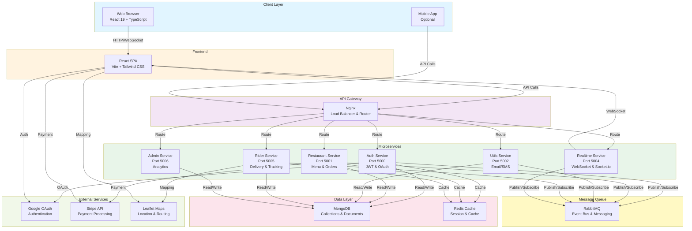

# Food Delivery Platform - Frontend

A modern, full-featured food delivery application frontend built with **React 19**, **TypeScript**, and **Vite**. This application connects users, restaurants, riders, and admins in a seamless food ordering and delivery ecosystem.

## Table of Contents

- [Project Overview](#project-overview)
- [Features](#features)
- [Tech Stack](#tech-stack)
- [Prerequisites](#prerequisites)
- [Setup Instructions](#setup-instructions)
- [Project Structure](#project-structure)
- [Available Scripts](#available-scripts)
- [Configuration](#configuration)
- [User Roles](#user-roles)
- [Key Components](#key-components)
- [API Integration](#api-integration)
- [Deployment](#deployment)
- [Development](#development)
- [Contributing](#contributing)
- [License](#license)

## Project Overview

This is the frontend component of a comprehensive food delivery platform that enables:

- **Users**: Browse restaurants, place orders, track deliveries, and manage accounts
- **Restaurants**: Manage menus, view orders, and track restaurant operations
- **Riders**: Accept delivery orders and manage real-time delivery routes
- **Admins**: Monitor system metrics, manage restaurants, and oversee operations

The platform features real-time order tracking with WebSocket integration, interactive mapping for delivery routes, secure payment processing via Stripe, and OAuth authentication with Google.

## Features

### User Features

- User authentication (Email/Password and Google OAuth)
- Browse restaurants with advanced filtering
- Browse restaurant menus and add items to cart
- Manage shopping cart with real-time updates
- Secure checkout and payment processing
- Real-time order tracking with live map integration
- Route optimization for delivery navigation
- Order history and reordering functionality
- User profile and address management
- Email notifications for order updates

### Restaurant Features

- Restaurant profile management
- Menu management (add/edit/delete items)
- Order management dashboard
- View restaurant analytics and statistics
- Real-time order notifications
- Mobile-friendly restaurant operations

### Rider Features

- Real-time delivery request notifications
- Interactive map for delivery routes
- Accept/reject delivery orders
- Live location tracking
- Route optimization for multiple deliveries
- Earnings and performance dashboard

### Admin Features

- User management and verification
- Restaurant management and onboarding
- Rider management and performance monitoring
- System analytics and reporting
- Content and order management

## Tech Stack

### Frontend Framework

- **React 19** - Modern UI library with latest React features
- **TypeScript 5.9** - Static typing for robust code
- **Vite 7** - Lightning-fast build tool and dev server

### UI & Styling

- **Tailwind CSS 4** - Utility-first CSS framework
- **React Icons 5.5** - Icon library with multiple icon sets
- **React Hot Toast 2.6** - Toast notifications

### Routing & State

- **React Router DOM 7** - Client-side routing
- **Context API** - State management with React Context

### Real-time Communication

- **Socket.io Client 4.8** - Real-time bidirectional communication for order tracking

### Maps & Location

- **Leaflet 1.9** - Interactive mapping library
- **React Leaflet 5** - React components for Leaflet
- **Leaflet Routing Machine 3.2** - Route optimization and display

### Payment & Authentication

- **Stripe JS 8.7** - Secure payment processing
- **React OAuth/Google** - Google OAuth authentication

### HTTP Client

- **Axios 1.13** - Promise-based HTTP client

### Development Tools

- **ESLint 9.39** - Code linting
- **TypeScript ESLint** - TypeScript-specific linting rules
- **Vite React Plugin** - Fast refresh for React development

## Architecture

### System Architecture Diagram



### Architecture Overview

**Client Layer**: Web browser and optional mobile applications

**Frontend Layer**: React Single Page Application (SPA) built with Vite, featuring TypeScript for type safety and Tailwind CSS for styling. Real-time communication via WebSocket.

**API Gateway**: Nginx acts as the central gateway, routing requests to appropriate microservices and providing load balancing.

**Microservices Layer**: Six independent Node.js microservices handling specific domains:

- Auth Service: User authentication and authorization
- Restaurant Service: Restaurant and menu management
- Utils Service: Email, SMS, and other utilities
- Rider Service: Delivery partner and tracking management
- Realtime Service: WebSocket server for live updates
- Admin Service: System analytics and admin operations

**Data Layer**:

- MongoDB for persistent storage
- Redis for caching and session management

**Message Queue**: RabbitMQ for asynchronous communication between services

**External Integrations**: Third-party services for authentication (Google OAuth), payments (Stripe), and mapping (Leaflet)

## Prerequisites

Before you begin, ensure you have the following installed:

- **Node.js** (v18.x or higher) - [Download](https://nodejs.org/)
- **npm** (v9.x or higher) - Comes with Node.js
- **Git** - [Download](https://git-scm.com/)

Optional but recommended:

- **Docker** - For containerized development
- **VS Code** - Recommended code editor

## Setup Instructions

### 1. Clone the Repository

```bash
git clone https://github.com/your-repo/food-delivery-platform.git
cd services/frontend
```

### 2. Install Dependencies

```bash
npm install
```

### 3. Configure Environment Variables

Create a `.env` file in the root directory and add the following variables:

```env
# API Configuration
VITE_API_BASE_URL=http://localhost:8081
VITE_REALTIME_URL=http://localhost:5004

# Google OAuth
VITE_GOOGLE_CLIENT_ID=your_google_client_id_here

# Stripe Configuration
VITE_STRIPE_PUBLIC_KEY=your_stripe_public_key_here

# Map Configuration
VITE_MAP_TILE_URL=https://{s}.tile.openstreetmap.org/{z}/{x}/{y}.png
```

### 4. Start Development Server

```bash
npm run dev
```

The application will be available at `http://localhost:5173`

### 5. Build for Production

```bash
npm run build
```

### 6. Preview Production Build

```bash
npm run preview
```

## Project Structure

```
frontend/
├── public/                     # Static assets
│   └── [static files]
├── src/
│   ├── assets/                # Images, icons, and media files
│   ├── components/            # Reusable React components
│   │   ├── AddMenuItem.tsx              # Add menu item form
│   │   ├── AddRestaurant.tsx            # Add restaurant form
│   │   ├── AdminRestaurantCard.tsx      # Restaurant card for admin
│   │   ├── footer.tsx                   # Footer component
│   │   ├── MenuItems.tsx                # Menu items display
│   │   ├── navbar.tsx                   # Navigation bar
│   │   ├── OrderCard.tsx                # Order display card
│   │   ├── protectedRoute.tsx           # Route protection wrapper
│   │   ├── publicRoute.tsx              # Public route wrapper
│   │   ├── RestaurantCard.tsx           # Restaurant card component
│   │   ├── RestaurantOrders.tsx         # Restaurant orders view
│   │   ├── RestaurantProfile.tsx        # Restaurant profile management
│   │   ├── RiderAdmin.tsx               # Rider admin panel
│   │   ├── RiderCurrentOrder.tsx        # Current delivery order display
│   │   ├── RiderOrderMap.tsx            # Map for rider delivery route
│   │   ├── RiderOrderRequest.tsx        # Incoming delivery request
│   │   ├── UserOrderMap.tsx             # Map for user order tracking
│   ├── context/               # React Context for state management
│   │   ├── AppContext.tsx               # Global app state
│   │   ├── SocketContext.tsx            # WebSocket connection state
│   ├── pages/                 # Page components (routes)
│   │   ├── Account.tsx                  # User account settings
│   │   ├── Address.tsx                  # User address management
│   │   ├── Admin.tsx                    # Admin dashboard
│   │   ├── Cart.tsx                     # Shopping cart
│   │   ├── Checkout.tsx                 # Checkout & payment
│   │   ├── Home.tsx                     # Home/restaurants listing
│   │   ├── Login.tsx                    # Login page
│   │   ├── OrderPage.tsx                # Order details
│   │   ├── Orders.tsx                   # Order history
│   │   ├── OrderSuccess.tsx             # Order confirmation
│   │   ├── PaymentSuccess.tsx           # Payment confirmation
│   │   ├── Restaurant.tsx               # Restaurant menu view
│   │   ├── RestaurantPage.tsx           # Restaurant page
│   │   ├── RiderDashboard.tsx           # Rider dashboard
│   │   ├── SelectRole.tsx               # Role selection page
│   ├── utils/                 # Utility functions and helpers
│   │   ├── orderflow.ts                 # Order processing utilities
│   ├── App.tsx                # Main application component
│   ├── main.tsx               # Application entry point
│   ├── index.css              # Global styles
│   ├── types.ts               # TypeScript type definitions
├── .dockerignore              # Docker ignore file
├── .env                       # Environment variables (not in repo)
├── .gitignore                 # Git ignore patterns
├── Dockerfile                 # Docker container configuration
├── eslint.config.js           # ESLint configuration
├── index.html                 # HTML entry point
├── package.json               # Project dependencies and scripts
├── tsconfig.json              # TypeScript configuration
├── tsconfig.app.json          # TypeScript app-specific config
├── tsconfig.node.json         # TypeScript Node config
├── vercel.json                # Vercel deployment configuration
├── vite.config.ts             # Vite configuration
└── README.md                  # This file
```

## Available Scripts

| Script            | Description                                          |
| ----------------- | ---------------------------------------------------- |
| `npm run dev`     | Start development server with hot module replacement |
| `npm run build`   | Build optimized production bundle                    |
| `npm run preview` | Preview the production build locally                 |
| `npm run lint`    | Run ESLint to check code quality                     |

## Configuration

### Vite Configuration (`vite.config.ts`)

Configured with React plugin for optimal development experience and fast refresh.

### TypeScript Configuration (`tsconfig.json`)

- Strict mode enabled for type safety
- JSX transformation for React
- Module resolution for ES modules

### ESLint Configuration (`eslint.config.js`)

- React-specific rules
- TypeScript support
- React Hooks best practices

## User Roles

The application supports multiple user roles with different permissions:

### 1. **User / Customer**

- Browse restaurants and menus
- Place orders
- Track deliveries in real-time
- Manage orders and account
- View order history

### 2. **Restaurant**

- Manage restaurant profile and menus
- View and manage incoming orders
- Monitor restaurant analytics

### 3. **Rider / Delivery Partner**

- Accept delivery requests
- Track and optimize delivery routes
- View delivery history and earnings

### 4. **Admin**

- Manage users, restaurants, and riders
- System analytics and reporting
- Platform content management

## Key Components

### AppContext

Manages global application state including:

- User authentication and profile
- Cart state
- Global notifications

### SocketContext

Handles real-time communication for:

- Live order status updates
- Real-time notifications
- Location tracking

### Protected/Public Routes

Route protection components that:

- Verify user authentication
- Check user role authorization
- Redirect unauthorized access

## API Integration

The frontend communicates with backend microservices through:

**API Base URL**: `http://localhost:8081` (Nginx gateway)

### Main Services

- **Auth Service** - User authentication and JWT tokens
- **Restaurant Service** - Restaurant and menu management
- **Order Service** - Order creation and management
- **Rider Service** - Rider management and delivery tracking
- **Real-time Service** - WebSocket for live updates
- **Utils Service** - Email, SMS, and utility functions
- **Admin Service** - Admin operations and analytics

### Real-time Updates

Socket.io connection established to `http://localhost:5004` for:

- Order status updates
- Rider location tracking
- Real-time notifications

## Deployment

### Docker Deployment

Build Docker image:

```bash
docker build -t food-delivery-frontend:latest .
```

Run container:

```bash
docker run -p 3000:80 food-delivery-frontend:latest
```

### Vercel Deployment

The project includes `vercel.json` configuration for easy Vercel deployment:

```bash
vercel deploy
```

### Kubernetes Deployment

See `../food-delivery-k8s/` for Kubernetes manifests and deployment instructions using ArgoCD.

## Development

### Hot Module Replacement (HMR)

Changes are instantly reflected in the browser during development with Vite's fast refresh.

### Type Checking

TypeScript provides compile-time type checking to catch errors early.

### Code Quality

ESLint ensures consistent code style and catches potential issues.

### Browser DevTools

React DevTools recommended for component inspection and debugging.

## Best Practices

- Follow TypeScript strict mode guidelines
- Use functional components with hooks
- Maintain component reusability
- Keep components focused and small
- Use proper error handling and loading states
- Implement proper loading and error boundaries

## Contributing

1. Create a feature branch: `git checkout -b feature/your-feature`
2. Commit your changes: `git commit -am 'Add your feature'`
3. Push to the branch: `git push origin feature/your-feature`
4. Submit a pull request

## License

This project is licensed under the MIT License - see the LICENSE.md file for details.

## Support

For issues, questions, or suggestions:

- Create an issue on GitHub
- Check existing documentation
- Contact the development team

---

Built with care for food lovers everywhere
import reactDom from 'eslint-plugin-react-dom'

export default defineConfig([
globalIgnores(['dist']),
{
files: ['**/*.{ts,tsx}'],
extends: [
// Other configs...
// Enable lint rules for React
reactX.configs['recommended-typescript'],
// Enable lint rules for React DOM
reactDom.configs.recommended,
],
languageOptions: {
parserOptions: {
project: ['./tsconfig.node.json', './tsconfig.app.json'],
tsconfigRootDir: import.meta.dirname,
},
// other options...
},
},
])

```

```
